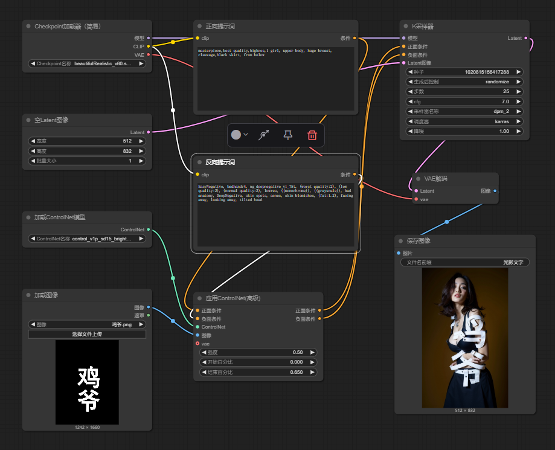

> 曾经很火的光影文字效果图, 网上很多webui教程, 没找到有comfyui的工作流, 于是我就简单搞了一个来玩

# 工作流
- [光影文字.json](./光影文字.json)

# 推荐模型:
+ 大模型: beautifulRealistic_v60.safetensors
+ ControlNet模型: control_v1p_sd15_brightness.safetensors

# 正向提示词:
masterpiece,best quality,highres,1 girl, upper body, huge breast, cleavage,black skirt,

# 反向提示词:
EasyNegative, badhandv4, ng_deepnegative_v1_75t, (worst quality:2), (low quality:2), (normal quality:2), lowres, ((monochrome)), ((grayscale)), bad anatomy, DeepNegative, skin spots, acnes, skin blemishes, (fat:1.2), facing away, looking away, tilted head

# 步骤
+ 1.用ps做一个类似这样的黑白图

    

+ 2.在工作流中的ControlNet选择黑白图

    

+ 3.ControleNet可微调参数:
    
    强度(Control Weigh): 建议 0.4-0.65 数值越大，图案就会越明显，但相对的，文字和图片的融合度也会越差

    结束百分比(Ending Control Step): 建议 0.6-0.75, 数值越大, 文字融合度就越差

  
  

